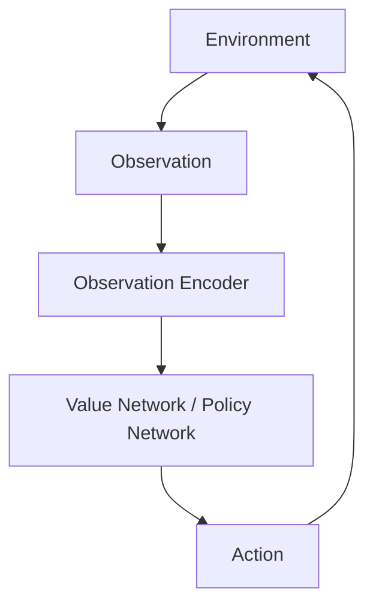

## Introduction
GNNs mostly used for supervised learning. Underutilised in RL. Advantages over traditional networks. Here are some examples of how to use it, and some avenues for exploration

## Preliminaries

RL is a method of solving a sequential decision-making problem in the form of a Markov Decision Process (MDP).
An MDP is defined as a tuple $$\langle S, A, T, R, \gamma \rangle$$, where $$S$$ is the set of states, $$A$$ is the set of actions, $$T: S \times A \times S \rightarrow [0, 1]$$ is the transition function, $$R: S \times A \rightarrow \mathbb{R}$$ is the reward function, and $$\gamma \in [0, 1)$$ is the discount factor.

- rl terminology: episodes, returns, policy, value function, observation, action space
- value-based methods and policy methods. how to extract a policy from a value function.

## Traditional Deep Reinforcement Learning

Deep RL refers to the integration of deep learning techniques with RL algorithms.
In particular, deep neural networks are used as function approximators for the value function or policy function. 
Here's what a typical deep RL architecture might look like:



The key neural components in this architecture are the observation encoder and the value/policy network.
The observation encoder processes raw observations from the environment (e.g., images, sensor data) into a latent representation.
The value/policy network then takes this latent representation as input and outputs either the estimated value of each action (in value-based methods) or the parameters of the action distribution (in policy-based methods).

- List some examples of benchmark RL problems and their observation space and action space

- Limitations of traditional deep RL methods:
  - Fixed-size action spaces
  - Poor generalisation to larger or smaller problem instances
- Can achieve generalisation through tricks like padding or breaking up the space, partial observability
  - Example and how it breaks

## Reinforcement with Graph Neural Networks

- Define a graph, what an MDP looks like on a graph
- How GNNs can be used to process graph-structured observations
- How GNNs can be used to model policies/value functions that can handle variable-size action spaces
- Examples of use

### Example 1: Combinatorial Optimisation on Graphs 

### Example 2: Multi-Agent RL on Graphs

### Example 3: 


## Design Considerations
- Design of action space (graph-level vs node-level actions, edge level harder but doable)
  - What if actions don't map directly to nodes/edges?
  - Design of the Action Space
	- Can go from GNN output -> edge or node selection or graph action with MLP
	- Unclear how to extend this though - what if nodes don't directly map to actions?
		- Current GNNs require a lot of homophily
		- Might need separate sub-architecture

## Implementation Example

## Conclusion


---

This theme supports rendering beautiful math in inline and display modes using [MathJax 3](https://www.mathjax.org/) engine.
You just need to surround your math expression with `$$`, like `$$ E = mc^2 $$`.
If you leave it inside a paragraph, it will produce an inline expression, just like $$ E = mc^2 $$.

To use display mode, again surround your expression with `$$` and place it as a separate paragraph.
Here is an example:

$$
\left( \sum_{k=1}^n a_k b_k \right)^2 \leq \left( \sum_{k=1}^n a_k^2 \right) \left( \sum_{k=1}^n b_k^2 \right)
$$

Note that MathJax 3 is [a major re-write of MathJax](https://docs.mathjax.org/en/latest/upgrading/whats-new-3.0.html)
that brought a significant improvement to the loading and rendering speed, which is now
[on par with KaTeX](http://www.intmath.com/cg5/katex-mathjax-comparison.php).

## Images and Figures




### Interactive Figures


<div class="l-page">
  <iframe src="{{ 'assets/html/2026-04-27-distill-example/plotly_demo_1.html' | relative_url }}" frameborder='0' scrolling='no' height="600px" width="100%"></iframe>
</div>

## Citations

The citation is presented inline like this: <d-cite key="gregor2015draw"></d-cite> (a number that displays more information on hover).
If you have an appendix, a bibliography is automatically created and populated in it.

---

## Footnotes

Just wrap the text you would like to show up in a footnote in a `<d-footnote>` tag.
The number of the footnote will be automatically generated.<d-footnote>This will become a hoverable footnote.</d-footnote>

---

## Code Blocks

The keyword `linenos` triggers display of line numbers. You can try toggling it on or off yourself below:



int main(int argc, char const \*argv[])
{
string myString;

    cout << "input a string: ";
    getline(cin, myString);
    int length = myString.length();

    char charArray = new char * [length];

    charArray = myString;
    for(int i = 0; i < length; ++i){
        cout << charArray[i] << " ";
    }

    return 0;

}



---


## Other Typography?

Emphasis, aka italics, with _asterisks_ (`*asterisks*`) or _underscores_ (`_underscores_`).

Strong emphasis, aka bold, with **asterisks** or **underscores**.

Combined emphasis with **asterisks and _underscores_**.

Strikethrough uses two tildes. ~~Scratch this.~~

1. First ordered list item
2. Another item

- Unordered sub-list.

1. Actual numbers don't matter, just that it's a number
   1. Ordered sub-list
2. And another item.

   You can have properly indented paragraphs within list items. Notice the blank line above, and the leading spaces (at least one, but we'll use three here to also align the raw Markdown).

   To have a line break without a paragraph, you will need to use two trailing spaces.
   Note that this line is separate, but within the same paragraph.
   (This is contrary to the typical GFM line break behavior, where trailing spaces are not required.)

- Unordered lists can use asterisks

* Or minuses

- Or pluses

[I'm an inline-style link](https://www.google.com)

[I'm an inline-style link with title](https://www.google.com "Google's Homepage")

[I'm a reference-style link][Arbitrary case-insensitive reference text]

[I'm a relative reference to a repository file](../blob/master/LICENSE)

[You can use numbers for reference-style link definitions][1]

Or leave it empty and use the [link text itself].

URLs and URLs in angle brackets will automatically get turned into links.
http://www.example.com or <http://www.example.com> and sometimes
example.com (but not on Github, for example).

Some text to show that the reference links can follow later.

[arbitrary case-insensitive reference text]: https://www.mozilla.org
[1]: http://slashdot.org
[link text itself]: http://www.reddit.com

Here's our logo (hover to see the title text):

Inline-style:


Reference-style:
![alt text][logo]

[logo]: https://github.com/adam-p/markdown-here/raw/master/src/common/images/icon48.png "Logo Title Text 2"

Inline `code` has `back-ticks around` it.

```javascript
var s = "JavaScript syntax highlighting";
alert(s);
```

```python
s = "Python syntax highlighting"
print(s)
```

```
No language indicated, so no syntax highlighting.
But let's throw in a <b>tag</b>.
```

Colons can be used to align columns.

| Tables        |      Are      |  Cool |
| ------------- | :-----------: | ----: |
| col 3 is      | right-aligned | $1600 |
| col 2 is      |   centered    |   $12 |
| zebra stripes |   are neat    |    $1 |

There must be at least 3 dashes separating each header cell.
The outer pipes (|) are optional, and you don't need to make the
raw Markdown line up prettily. You can also use inline Markdown.

| Markdown | Less      | Pretty     |
| -------- | --------- | ---------- |
| _Still_  | `renders` | **nicely** |
| 1        | 2         | 3          |

> Blockquotes are very handy in email to emulate reply text.
> This line is part of the same quote.

Quote break.

> This is a very long line that will still be quoted properly when it wraps. Oh boy let's keep writing to make sure this is long enough to actually wrap for everyone. Oh, you can _put_ **Markdown** into a blockquote.

Here's a line for us to start with.

This line is separated from the one above by two newlines, so it will be a _separate paragraph_.

This line is also a separate paragraph, but...
This line is only separated by a single newline, so it's a separate line in the _same paragraph_.
