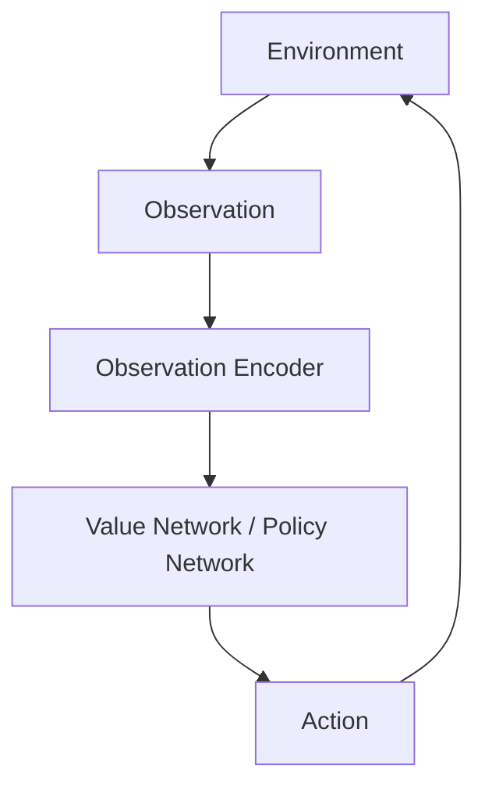
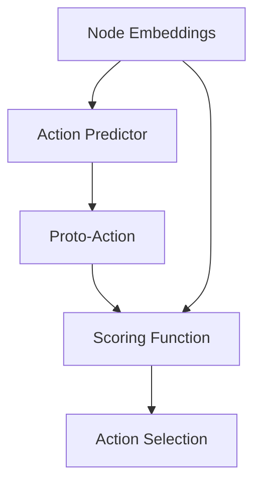

## Introduction

> add picture of GNN in RL setting

Graph Neural Networks (GNNs) have gained significant attention in recent years due to their ability to model relational data and capture complex interactions between entities.
To date, most applications of GNNs have been in paradigms such as supervised and unsupervised learning, used for tasks such as node classification, link prediction, and graph classification.

Deep reinforcement learning (RL) has also been an area of active research, with many successful applications in games, robotics, and control tasks.
However, the potential of GNNs in RL remains relatively underexplored.
Compared to traditional deep learning architectures such as convolutional neural networks (CNNs) and multi-layer perceptrons (MLPs), GNNs offer several advantages that enable novel capabilities in RL settings when used as a policy or value function approximator.
These include out-of-distribution (OOD) size generalisation, permutation invariance, and the ability to handle variable action spaces.
These properties have great value in applications such as multi-agent systems, navigation, combinatorial optimisation, and resource allocation.

We hypothesise that the lack of uptake of GNNs in RL is due to unclear design patterns for integrating GNNs into RL frameworks, as well as a lack of implementation support in popular RL libraries.
Thus, in this blog post, we aim to provide a comprehensive overview of GNNs in RL, focusing on the practical design aspects of using GNNs as policy or value function approximators.

## Preliminaries

### Reinforcement Learning
RL is a method of solving a sequential decision-making problem in the form of a Markov Decision Process (MDP).
An MDP is defined as a tuple $$\langle S, A, T, R, \gamma \rangle$$, where $$S$$ is the set of states, $$A$$ is the set of actions, $$T: S \times A \times S \rightarrow [0, 1]$$ is the transition function, $$R: S \times A \rightarrow \mathbb{R}$$ is the reward function, and $$\gamma \in [0, 1)$$ is the discount factor.

- rl terminology: episodes, returns, policy, value function, environment, observation, action space
- value-based methods and policy methods. how to extract a policy from a value function.

### Graph Neural Networks

- brief overview of GNNs
- examples in supervised learning etc
- introduce graph notation and node/edge features

Suppose we have a graph $$G = (V, E)$$, with nodes $V$ and edges $E$.
The nodes describe some sort of item, and the edges describe some sort of relationship between them.

## Traditional Deep Reinforcement Learning

Deep RL refers to the integration of deep learning techniques with RL algorithms.
In particular, deep neural networks are used as function approximators for the value function or policy function. 
Here's what a typical deep RL architecture might look like:

The key neural components in this architecture are the observation encoder and the value/policy network.
The observation encoder processes raw observations from the environment (e.g., images, sensor data) into a latent representation.
The value/policy network then takes this latent representation as input and outputs either the estimated value of each action (in value-based methods) or the parameters of the action distribution (in policy-based methods).

<!-- Let's have a look at some popular deep RL benchmark problems.
- **Lunar Lander**: 
  - Observation space: 8-dimensional vector -- lander coordinates, velocities, and contacts.
  - Action space: $$\{0, 1, 2, 3\}$$ -- do nothing, fire left engine, fire main engine, fire right engine. -->

As powerful and well-studied as these methods are, there are a number of limitations inherent in their representational power, which we discuss below.

### Permutation Sensitivity
Graphs nominally enjoy the property of permutation invariance: regardless of the ordering of the nodes, the properties are the same, as only the *relationships* between the nodes are important.
When we write down a graph's representation using an adjacency matrix, we implicitly create an ordering of the nodes.

> insert figure showing one graph that leads to two adjacency matrices

If we use the matrix representation of the graph as input to a neural network, we lose the property of permutation invariance.
The two adjacency matrices above are created from the same graph. Fed to an MLP, we get two very different outputs.
This means that in order to train our network to, say, classify graphs based on their structure, we would have to add permutations of the training data in order to ensure that it learns to correctly classify what is fundamentally the same graph.

Let's use the game of tic-tac-toe as an example. 
This game is represented by a $$3\times 3$$ grid, in which spaces can be blank, or contain an $$\texttt{X}$$ or $$\texttt{O}$$.
A simple representation of this state would be a $$3\times 3$$ matrix with each entry corresponding to the contents of the space on the board.
This kind of state representation is easily handled by an appropriately sized CNN layer or MLP after vectorisation.
An important property of the game tic-tac-toe is that the orientation of the board does not matter: we can consider game states to be the same if they are the same under rotation or reflection.
However, without external intervention, **our network does not know this**.
Without considering this kind of permutation invariance, there are **eight times** as many tic-tac-toe states that the model must learn to solve.
In a simple environment like tic-tac-toe we can easily modify the state representation to collapse symmetries and avoid this issue.
However, in general, permutation invariance is not always an easy property to engineer.
This is where GNNs can be very useful, as permutation invariance is an intrinsic property of the network, inherently collapsing equivalent state representations for free.

### Action Spaces

- imagine navigating in a map, there are up to n doors in each room so you make that the action space (pad it for rooms with less doors)
  - on a new map if there are n+1 doors the policy does not work, matrix is the wrong shape, have to retrain the policy entirely
  - this has led to popularity of grid worlds where actions have a fixed shape
  - we could instead use the neighbours as possible actions (GNN)

### Size Generalisation
- traditional network on adjacency matrix means imposing max size, what if one more node gets added? broken
- in a graph structure the number of nodes is fully flexible
- Can achieve generalisation through tricks like padding or breaking up the space, partial observability
  - Example and how it breaks

## Reinforcement Learning with Graph Neural Networks

Can we use a GNN as the main policy network in a deep RL process?
The answer is, of course, yes.
Since GNNs operate on graphs, the environment must output graph-like observations.

Going back to our tic-tac-toe example, we will define a *node* to be any of the nine possible positions on the board.
We will define *edges* such that two nodes are connected by an edge if they are adjacent on the board.
Finally, we will define a categorical *node feature* $$\in \{0, 1, 2\}$$, which tells us that the node contains a blank space, $$\texttt{X}$$, or $$\texttt{O}$$ respectively.

- Define a graph, what an MDP looks like on a graph
- How GNNs can be used to process graph-structured observations

- Advantages examples
  - tic tac toe : permutation invariant (don't have to process symmetries)
  - open team size collaboration
  
## Environments as Graphs
<!-- todo: explicitly talk about the RL methods used in each example -->
<!-- todo: highlight advantage of GNNs in each example -->

In order to use GNNs in RL, we need to represent the environment as a graph.
This means defining:
1. What is a node?
2. What is an edge?
3. What node and edge features are present?
4. What is the action space, and how does it relate to the graph structure?

Generally, nodes represent entities in the environment, while edges represent relationships or interactions between those entities.
Nodes and edges can be equipped with features that describe their properties, such as weight, status, or type.

Perhaps the most important and most difficult aspect of using GNNs in RL is defining the action space.
In traditional RL, the action space is often fixed and discrete, or continuous within a certain range.
However, when using GNNs, the action space can be more complex and dynamic, depending on the graph structure.
In the following sections, we discuss several common approaches to defining action spaces in GNN-based RL environments.

### Fixed Action Spaces

The most straightforward way to use a GNN in RL is to use it as a feature extractor for environments with fixed action spaces.
In this case, the GNN processes the graph-structured observation from the environment and produces a graph or node-level embedding vector.
This vector is then passed to an MLP or similar network to produce action values or action probabilities.

> insert diagram of GNN feature extractor feeding into MLP for action selection

When using a GNN as a feature extractor, there are two main approaches to obtaining the action space from the graph embedding: pooling the node embeddings to get a graph-level embedding, or using the node embeddings directly.
If the graph embedding is pooled to a single vector, it is important to consider the pooling method used.
Common pooling methods include mean pooling, max pooling, and sum pooling.
These methods are permutation invariant, meaning that the order of the nodes does not affect the resulting graph embedding.
However, methods like summation are sensitive to the size of the graph, which can lead to issues when generalising to larger or smaller graphs.
Similarly, if using node embeddings directly, care must be taken in the selection of the aggregation method to preserve generalisation to different graph structures, for example if a larger number of neighbours are present than seen during training.

#### Example
+ Li et. al. <d-cite key="liMessageAwareGraphAttention2021"></d-cite> approach a distributed multi-robot path planning problem where agents can communicate with adjacent robots, represented by a dynamic distance-based communication graph. At each step, an agent can take an action from {up, down, left, right, idle}. Each agent observes obstacles within their field of view, which is processed by a CNN to produce node features. These features are communicated with neighbouring agents according to the graph structure, executing the message passing of the GNN in a distributed manner. To obtain the action distribution, the aggregated node embeddings are passed to an MLP followed by a softmax layer: $$f : \mathbb{R}^d \rightarrow \mathbb{R}^{5}$$, where $$d$$ is the dimension of the node embeddings.

### Neighbours as Actions

Many environments can be naturally represented as graphs where the possible actions correspond to the neighbours of a given node.
For example, in the navigation task mentioned earlier, each room could be represented as a node, with edges connecting rooms that are directly accessible from one another.
In this case, the action space is dynamic, and is represented by the neighbours of the current node.
The action space is not limited by a maximum size as in traditional RL settings, and can vary depending on the current node.
This type of action space is particularly useful in decentralised multi-agent settings, where each agent only has local information about its neighbours.

When using neighbours as actions, the typical approach is to use the GNN to produce node-level embeddings, which are then used to score the neighbours of the current node.
From these scores, an action distribution can be created, or the highest scoring neighbour can be selected directly.

> insert diagram of GNN producing node embeddings, scoring neighbours for action selection

#### Examples
+ Goeckner et. al. <d-cite key="goecknerGraphNeuralNetworkbased2024"></d-cite> pose a patrolling problem in which a team of agents must overcome partial observability, distrubed communications, and agent attrition. At each step, an agent chooses a node to move to from its current location $$v$$. To do this, the GNN-based embedding of each neighbour $$\{z_u | u \in \mathcal{N}(v)\}$$ is passed through a scoring MLP, $$\text{SCORE}: \mathbb{R}^d \rightarrow \mathbb{R}$$.
The scores of the neighbours are then passed to a selection MLP, which outputs the index of the action to take.
+ Pisacane et. al. <d-cite key="pisacaneReinforcementLearningDiscovers2024"></d-cite> approach a decentralised graph path search problem using only local information. Each node in the graph represents an agent, and each node is assigned an attribute vector $$\mathbf{x}_{u_i} \in \mathbb{R}^d$$. Given a target node $$u_{\text{tgt}}$$, the agent at node $$u_i$$ must select one of its neighbours to forward a message $$\mathbf{m} \in \mathbb{R}^d$$ to, with the goal of reaching the target node in as few hops as possible. To choose which neighbour should receive the message, a value estimate for each neighbour is generated using an MLP $$f$$, based on the embedding of the neighbour node and the embedding of the target node: $$v(u_i, u_{\text{tgt}}) = f_v([\mathbf{z}_{u_i} \| \mathbf{z}_{u_{\text{tgt}}}])$$. An action distribution is created by passing the value estimates through a softmax layer to get probabilities.

### Nodes as Actions

More generally, we can consider the entire set of nodes in the graph as possible actions.
This is particularly useful in environments where the agent can select any node in the graph as an action, such as in combinatorial optimisation problems.
Using this action space, an agent can be trained on graphs of small sizes, and learn a policy that generalises to much larger graphs at test time.

#### Score-Based
Similarly to the neighbours-as-actions approach, the node embeddings produced by the GNN can be scored to produce action values or action probabilities.

##### Example
+ In Darvariu et. al. <d-cite key="darvariuGoaldirectedGraphConstruction2021"></d-cite>, edges are to be added to a graph in order to maximise the robustness of the graph's connectivity against edge removals. The authors use Q-learning to derive a policy from action-value estimates for each node in the graph. The edge construction is posed as a two-step process: first selecting a source node, then a destination node. Given a proposed source node $$v$$, the Q-value in a graph state $$G$$ is given by $$Q(G, v) = f_1([\mathbf{z}_v \| \mathbf{z}_G])$$, where $$\mathbf{z}_G$$ is the graph-level embedding obtained via pooling and $$\mathbf{z}_v$$ is the node-level embedding of node $$v$$. After a source node is selected, a action-value estimates for the destination node $$u$$ are calculated using $$f_2([\mathbf{z}_v \| \mathbf{z}_u \| \mathbf{z}_G])$$. Here, $$f_1$$ and $$f_2$$ are 2-layer MLPs.

#### Proto-Action

Another method of selecting a node is to use a "proto-action": the network outputs a vector which represents the best action given the state.
Once we know what the embedding of the desired action looks like, we can choose which action to take based on those available.
The proto-action gets compared to the node embeddings of the other available actions using a scoring function, from which we can then produce a probability distribution or choose an action directly.
The inspiration for this approach comes from <d-cite key="dulac-arnoldDeepReinforcementLearning2016"></d-cite>, where the authors use a similar method to select actions in a continuous action space.

##### Examples
+ Darvariu et. al. <d-cite key="darvariuSolvingGraphbasedPublic2021"></d-cite> approach a public goods game, reformulated as finding a maximal independent set in a graph. At each step, a node is selected from the graph to add to the set, until no valid nodes remain. The authors create a proto-action by first summing the node embeddings and then passing it through an MLP. An action distribution is created by taking the Euclidean distance between the proto-action and each node embedding, passing these distances through a softmax layer to get probabilities.
+ Trivedi et. al. <d-cite key="trivediGraphOptLearningOptimization2020"></d-cite> seek to learn generative mechanisms for graph-structured data. Edges are formed by sampling two nodes from a Gaussian policy following $$\mathbf{a}^{(1)}, \mathbf{a}^{(2)} \sim \mathcal{N}(\mathbf{\mu}, \log(\mathbf{\sigma}^2))$$ given the policy $$\pi(s) = [\mathbf{\mu}, \log(\mathbf{\sigma}^2)] = g(Enc(s))$$, where $$g$$ is a 2 layer MLP and $$Enc$$ is a GNN.

<!-- TODO: \mathcal{N} redefinition conflict with neighbour notation -->

### Edges as Actions

In some types of problems, the actions naturally correpond to edges in the graph, rather than nodes.
For example, in a network routing problem, an agent may need to select edges to route data packets through a network.

As we saw in <d-cite key="darvariuGoaldirectedGraphConstruction2021"></d-cite> and <d-cite key="trivediGraphOptLearningOptimization2020"></d-cite>, one method of selecting edges is simply to decompose the edge selection into a pair of node selections.
While this approach is strightforward and works with existing GNN architectures, it can be less efficient, effectively doubling the number of forward passes required to select an edge.

Given an edge embedding, edges could be selected in a similar manner to nodes, either through scoring or proto-action methods.
However, most GNN architectures do not produce edge-level embeddings directly, instead prioritising node-level embeddings.
There are two main ways to obtain edge embeddings from a GNN:
1. Use the node embeddings to create edge embeddings by concatenating or summing the embeddings of the two nodes that form the edge. This is straightforward, but may not capture all the information about the edge itself, especially if the edge has attributes.
2. Use a line graph transformation to convert edges into nodes, allowing the GNN to produce edge-level embeddings directly. This approach has been used in works where edge attributes are more important than nodes, such as <d-cite key="jiangCensNetConvolutionEdgeNode2019"></d-cite> and <d-cite key="caiLineGraphNeural2022"></d-cite>. However, the line graph transformation generally increases the size of the graph, and can lead to some duplication of information.

Some works have explored edge-centric GNN architectures which directly produce edge embeddings, such as <d-cite key="zhaoLearningPrecodingPolicy2022a"></d-cite>, <d-cite key="yuLearningCountIsomorphisms2023"></d-cite> and <d-cite key="pengLearningResourceAllocation2024"></d-cite>, but to the best of our knowledge, this approach has not yet been applied in RL settings.

## Future Avenues

Using GNNs as policy or value function approximators in RL unlocks many new capabilities, but there are still a number of challenges and open questions that need to be addressed.

As discussed previously, defining the action space is a key challenge when using GNNs in RL.
Most existing works use either a fixed action space, or model actions as some function of nodes or edges.
Popular GNN architectures are primarily designed to produce node-level embeddings, with edge-based actions not so far explored in RL settings.
At this stage, modelling more complex action spaces, such as hybrids of fixed and graph-based actions, remains an open question.

The limitations of GNN architectures themselves can also limit their effectiveness in RL settings.
At present, many GNNs operate best under the assumption of homophily: that connected nodes are more likely to share similar features or labels.
GNNs have also been designed for heterophilous graphs, but these require a strict bipartite structure, limiting their applicability.
At present, even if an environment can be modelled as a graph, complex structures or interactions (such as distinct node types, or higher-order relationships) may create an environment that is not well-suited to existing GNN architectures.
Furthermore, many GNNs can be prone to over-smoothing, where node embeddings become indistinguishable after multiple message-passing layers.
This makes long-range dependencies difficult to capture, and can limit the effectiveness of GNNs in environments with large or complex graphs.

## Implementation Example

## Conclusion

